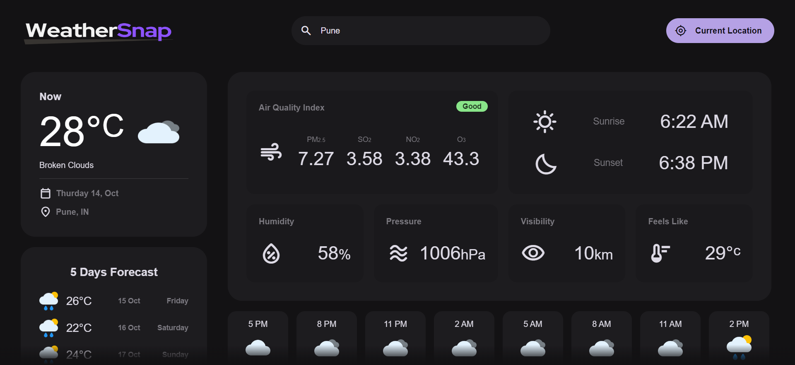
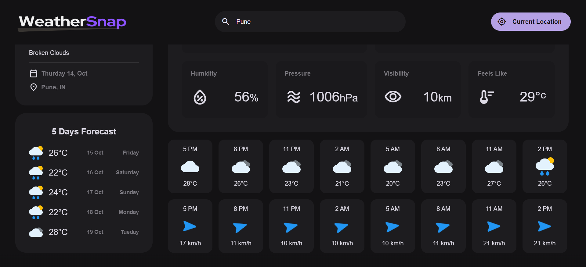

# WeatherSnap - Real-Time Weather Forecasting App

WeatherSnap is a real-time weather forecasting web application powered by the OpenWeatherMap API.
It provides users with up-to-the-minute weather data and forecasts using a user-friendly interface.

## Technology Stack

- HTML
- CSS
- JavaScript
- [OpenWeatherMap API](https://openweathermap.org/api)

## Features

- **Real-Time Data:** Get the latest weather updates as soon as they are available.
- **Current Weather:** View current weather conditions, including temperature , wind speed, and more.
- **Five-Day Forecast:** Plan your week with a 5-day weather forecast at your fingertips.
- **Hourly Timeline:** Track weather changes throughout the day with an hourly timeline.
- **Air Quality Index (AQI):** Stay informed about air pollution levels with real-time AQI data.
- **Sunrise and Sunset Times:** Know the exact times of sunrise and sunset for your location.
- **User-Friendly:** Designed with an intuitive and responsive user interface for easy navigation.
- **API Integration:** Utilizes the OpenWeatherMap API for accurate and reliable weather information.

## Screenshots

